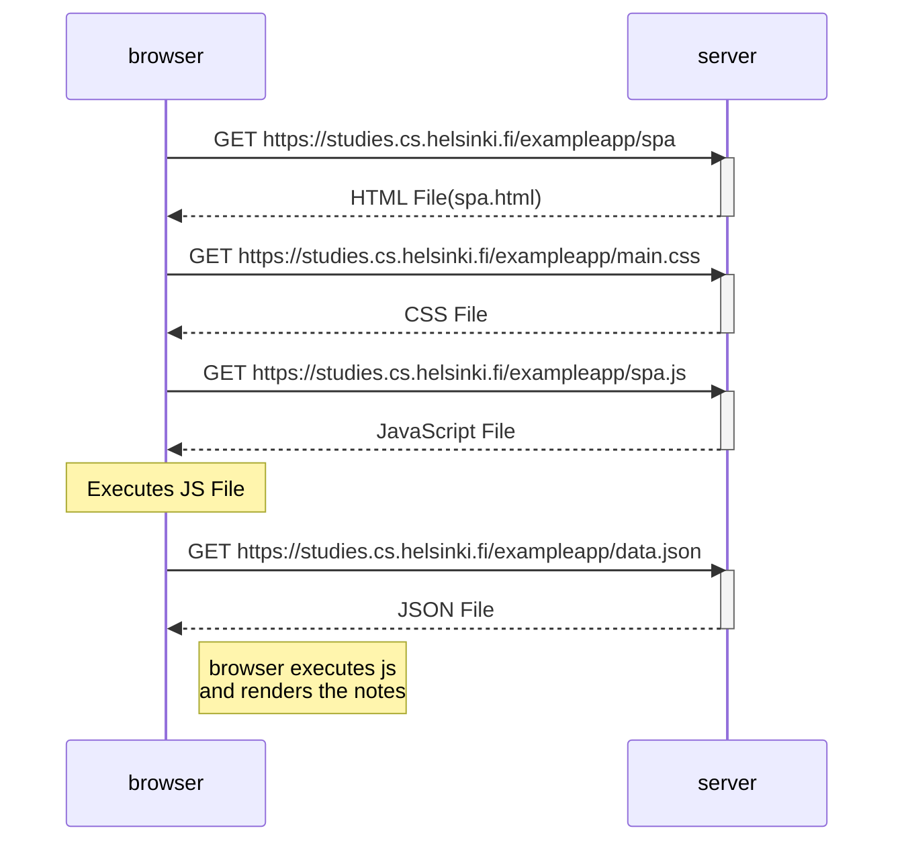

```mermaid
sequenceDiagram
participant A as browser
participant B as server
A->>B:GET https://studies.cs.helsinki.fi/exampleapp/spa
activate B
B-->>A: HTML File(spa.html)
deactivate B
A->>B: GET https://studies.cs.helsinki.fi/exampleapp/main.css
activate B
B-->>A:CSS File
deactivate B
A->>B: GET https://studies.cs.helsinki.fi/exampleapp/spa.js
activate B
B-->>A:JavaScript File
deactivate B
Note over A: Executes JS File
A->>B: GET https://studies.cs.helsinki.fi/exampleapp/data.json
activate B
B-->>A: JSON File
deactivate B
note right of A: browser executes js <br/> and renders the notes
```
