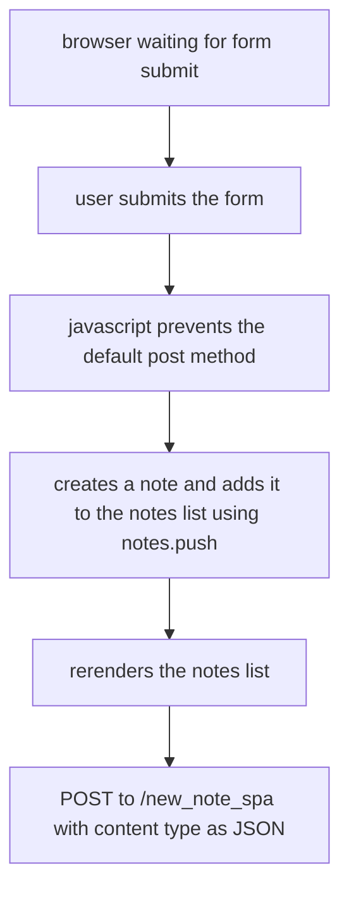
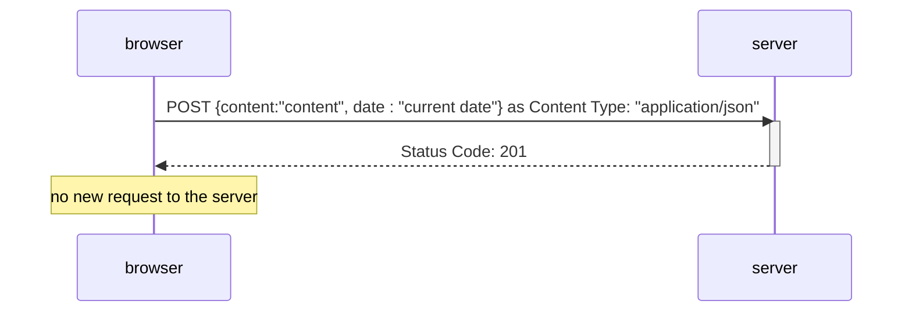

note: has two diagrams 

```mermaid
flowchart TD
A[browser waiting for form submit]-->B[user submits the form]
B-->C[javascript prevents the default post method]
C-->D[creates a note and adds it to the notes list using notes.push]
D-->E[rerenders the notes list]
E-->F[POST to /new_note_spa with content type as JSON]
```

```mermaid
sequenceDiagram
participant A as browser
participant B as server
A->>B: POST {content:"content", date : "current date"} as Content Type: "application/json"
activate B
B-->>A: Status Code: 201
deactivate B
Note over A: no new request to the server
```
