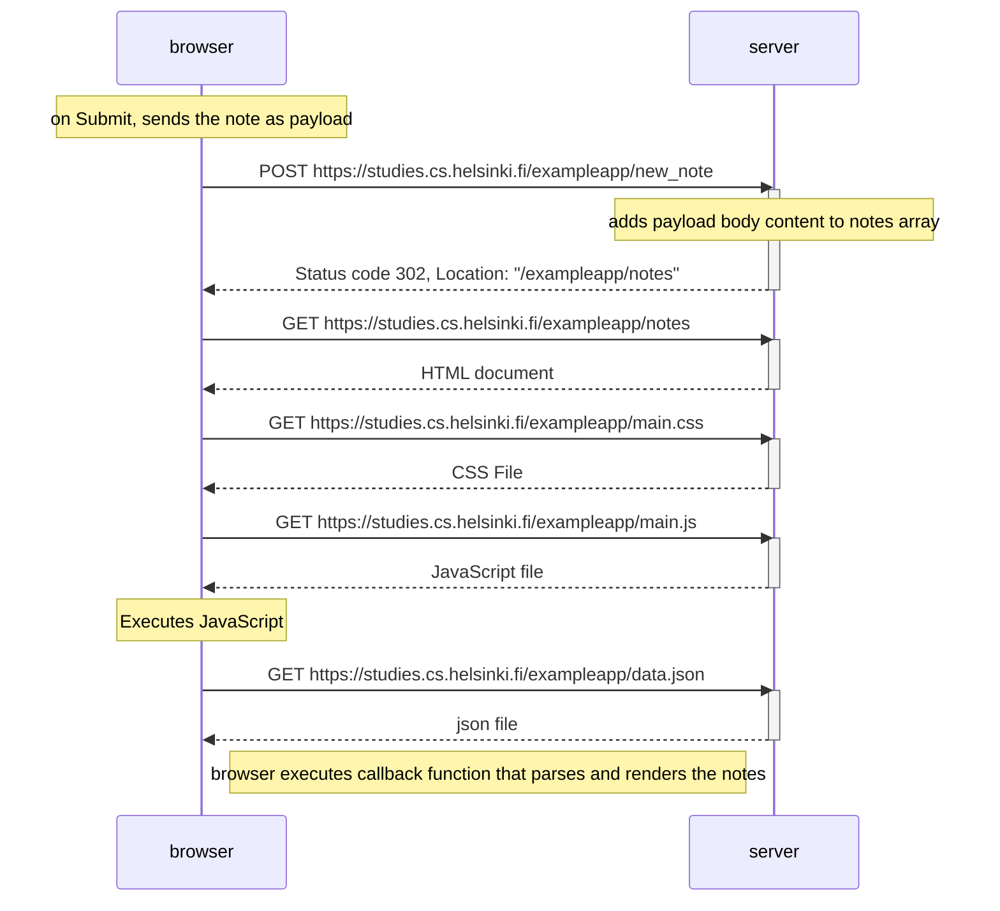

```mermaid
sequenceDiagram
    participant browser
    participant server
    Note over browser:  on Submit, sends the note as payload
    browser->>server: POST https://studies.cs.helsinki.fi/exampleapp/new_note
    activate server
    Note over server: adds payload body content to notes array
    server-->>browser: Status code 302, Location: "/exampleapp/notes"
    deactivate server
    browser->>server: GET https://studies.cs.helsinki.fi/exampleapp/notes
    activate server
    server-->>browser: HTML document
    deactivate server
    browser->>server: GET https://studies.cs.helsinki.fi/exampleapp/main.css
    activate server
    server-->>browser: CSS File
    deactivate server
    browser->>server: GET https://studies.cs.helsinki.fi/exampleapp/main.js
    activate server
    server-->>browser: JavaScript file
    deactivate server
    Note over browser: Executes JavaScript
    browser->>server: GET https://studies.cs.helsinki.fi/exampleapp/data.json
    activate server
    server-->>browser: json file
    deactivate server
    Note right of browser: browser executes callback function that parses and renders the notes
```
